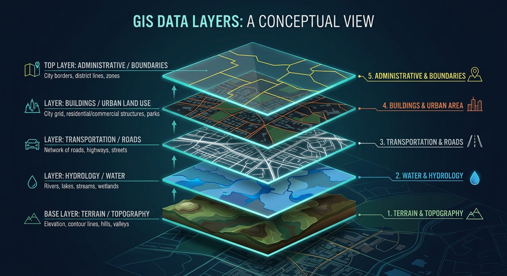
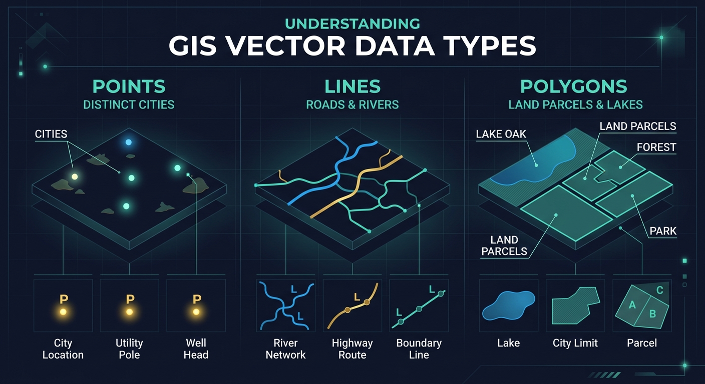
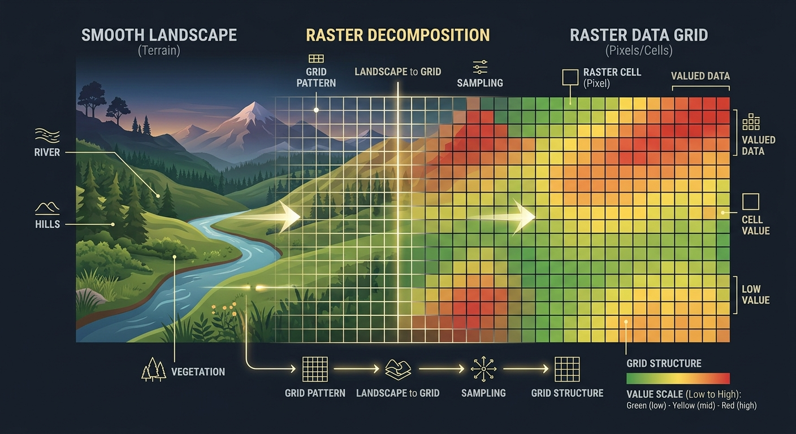
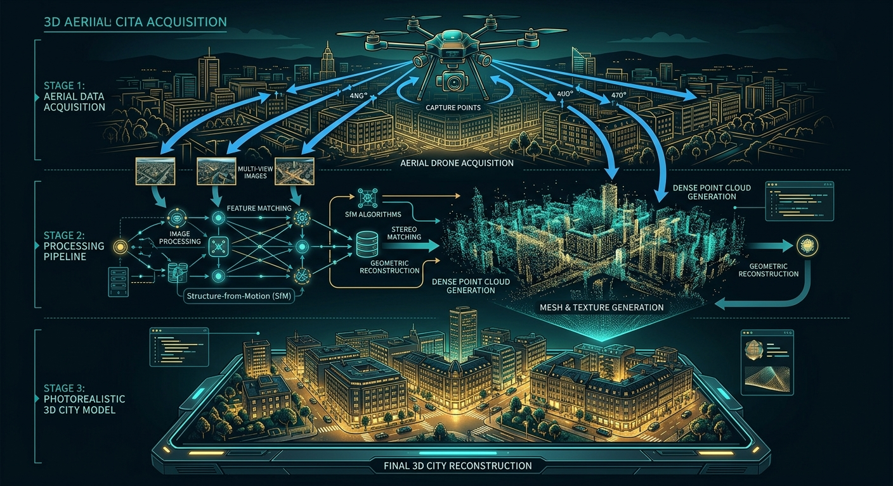
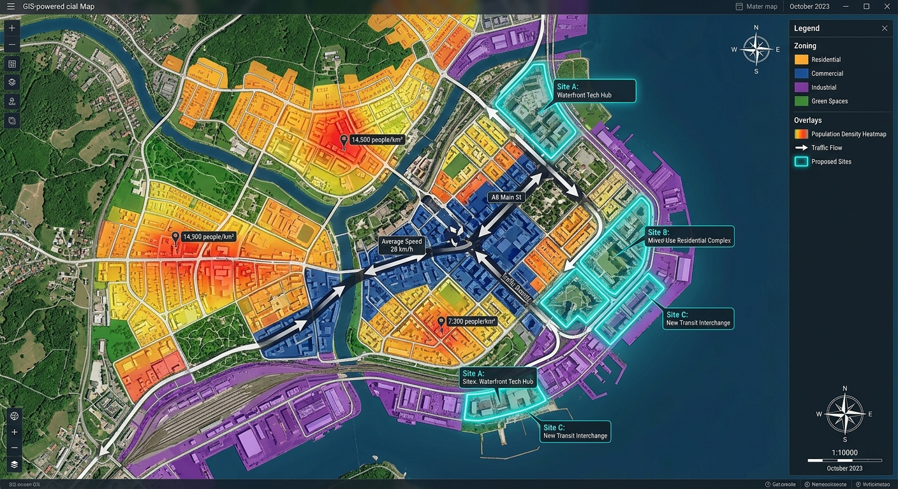
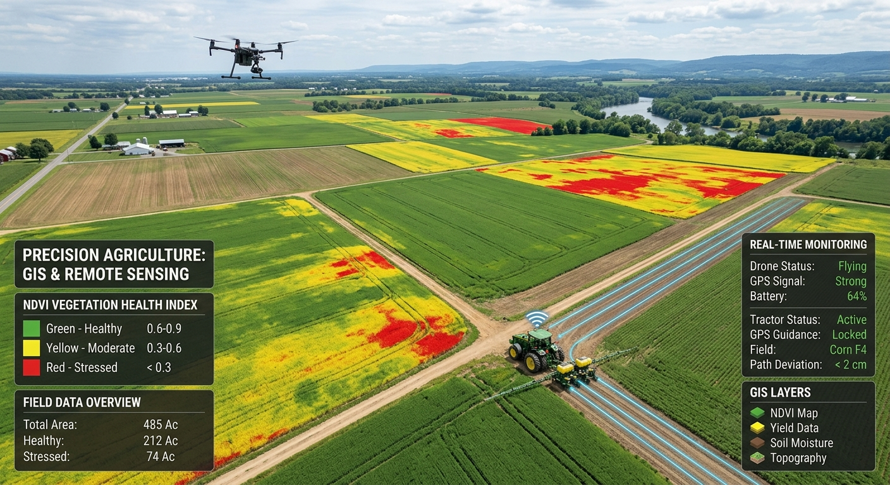
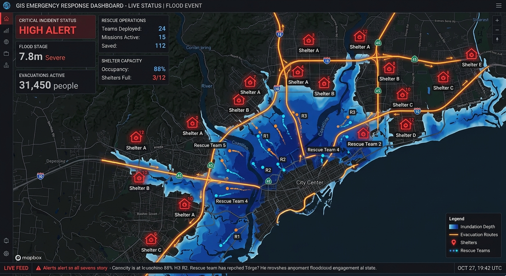
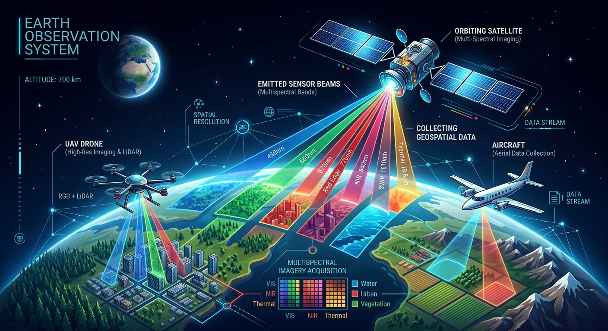

# 🌍 GIS 百科全书 · GIS Encyclopedia

> **最全面的中文 GIS 地理信息系统百科网站**
> 从 5 分钟入门到前沿论文索引，覆盖 16 个章节、数百个知识点、81 篇 2024-2026 最新研究论文

[](https://raymond1030.github.io/What-is-GIS/)
[](LICENSE)
[](#-章节目录)
[](https://raymond1030.github.io/What-is-GIS/chapters/research-frontier.html)
[](#-预览)

[](https://raymond1030.github.io/What-is-GIS/)
[](https://raymond1030.github.io/What-is-GIS/)
[](https://raymond1030.github.io/What-is-GIS/)
[](https://www.chartjs.org/)
[](https://claude.com/claude-code)
[](https://ai.google.dev/)

[](#)
[](#)
[](#)
[](#)
[](#)

---

## 🌐 在线访问

**👉 [raymond1030.github.io/What-is-GIS](https://raymond1030.github.io/What-is-GIS/)**

---

## 📸 预览

### 主页 · 英雄区


### GIS 图层叠加概念


### 核心数据模型
<table>
<tr>
<td width="50%"><br/><b>矢量数据 Vector</b></td>
<td width="50%"><br/><b>栅格数据 Raster</b></td>
</tr>
</table>

### 前沿方向
<table>
<tr>
<td width="50%"><br/><b>GeoAI 地理人工智能</b></td>
<td width="50%"><br/><b>数字孪生城市</b></td>
</tr>
<tr>
<td width="50%"><br/><b>三维重建</b></td>
<td width="50%"><br/><b>LBS 位置服务</b></td>
</tr>
</table>

### 应用场景
<table>
<tr>
<td width="50%"><br/><b>智慧城市规划</b></td>
<td width="50%"><br/><b>精准农业</b></td>
</tr>
<tr>
<td width="50%"><br/><b>应急管理</b></td>
<td width="50%"><br/><b>遥感技术</b></td>
</tr>
</table>

---

## ✨ 项目特色

- 🎓 **双重定位** · 面向零基础高中生入门，也面向研究生/从业者查找前沿论文
- 📚 **16 个深度章节** · 每个章节 30-76KB 内容，总计超过 900KB 纯 HTML
- 🖼️ **26+ 专业配图** · 16 张 Nano Banana AI 生成 + 9 张 Wikimedia Commons + NASA 公开图
- 🎨 **原创 SVG 可视化** · 矢量/栅格对比图、地图投影示意、空间分析图解、学习路径图
- 📖 **81 篇前沿论文** · 2024-2026 年 GeoAI、时空计算、GIS+LLM、遥感解译四大方向
- 📊 **交互式数据图表** · 使用 Chart.js 展示中国 2026 薪资调查、全球就业数据
- 🎥 **视频资源卡片** · 嵌入 Bilibili 中文教程 + YouTube 国际资源链接
- 📱 **响应式设计** · 深色主题 + 自定义字体 Syne + Noto Sans SC，完美适配移动端
- 🏗️ **无框架实现** · 纯 HTML + CSS + vanilla JS，静态部署，加载飞快
- 📐 **学术严谨** · 含 Tobler 地理学第一定律、Moran's I、Kriging 等完整公式推导

---

## 📚 章节目录

### 🌱 入门篇
| 章节 | 内容 | 大小 |
|------|------|------|
| 🎯 [什么是 GIS](https://raymond1030.github.io/What-is-GIS/chapters/what-is-gis.html) | 5 分钟快速入门 + 10 个日常应用 + 矢量/栅格可视化 | 35KB |
| 📜 [GIS 发展简史](https://raymond1030.github.io/What-is-GIS/chapters/history.html) | 从 1854 年 Snow 霍乱地图到 GeoAI 时代的完整历史 | 42KB |
| 🧭 [坐标系统与投影](https://raymond1030.github.io/What-is-GIS/chapters/coordinate-systems.html) | WGS84、CGCS2000、GCJ-02 火星坐标、EPSG 代码 | 43KB |

### ⚙️ 核心技术
| 章节 | 内容 | 大小 |
|------|------|------|
| 📐 [矢量数据模型](https://raymond1030.github.io/What-is-GIS/chapters/vector-data.html) | OGC Simple Feature、DE-9IM 拓扑、8 种格式对比 | 67KB |
| 🟪 [栅格数据模型](https://raymond1030.github.io/What-is-GIS/chapters/raster-data.html) | DEM/DSM/DTM、地图代数、5 种编码方法、重采样 | 52KB |
| 🔬 [空间分析技术](https://raymond1030.github.io/What-is-GIS/chapters/spatial-analysis.html) | Kriging 推导、Dijkstra 伪代码、KDE、GWR、坡度算法 | 66KB |
| 🛰️ [遥感技术](https://raymond1030.github.io/What-is-GIS/chapters/remote-sensing.html) | 电磁波谱、SAR、高光谱、Landsat/高分参数、GEE | 73KB |

### 🚀 前沿方向
| 章节 | 内容 | 大小 |
|------|------|------|
| 🤖 [GeoAI 地理人工智能](https://raymond1030.github.io/What-is-GIS/chapters/geoai.html) | 基础大模型 Prithvi、U-Net、STGCN、顶会动态 | 36KB |
| 🏙️ [数字孪生](https://raymond1030.github.io/What-is-GIS/chapters/digital-twin.html) | CIM 七级精度、BIM-GIS 融合、新加坡/雄安案例 | 30KB |
| 🧊 [三维 GIS 与重建](https://raymond1030.github.io/What-is-GIS/chapters/3d-gis.html) | 倾斜摄影、LiDAR、NeRF、3D Gaussian Splatting | 34KB |
| 📍 [LBS 位置服务](https://raymond1030.github.io/What-is-GIS/chapters/lbs.html) | GNSS、UWB 室内定位、高精度地图、隐私保护 | 38KB |

### 🛠️ 应用与生态
| 章节 | 内容 | 大小 |
|------|------|------|
| 💻 [GIS 软件完整指南](https://raymond1030.github.io/What-is-GIS/chapters/gis-software.html) | ArcGIS、QGIS、SuperMap、MapGIS、GEE 详细评测 | 54KB |
| 🎬 [应用领域大全](https://raymond1030.github.io/What-is-GIS/chapters/applications.html) | 12+ 真实案例 + 视频资源（含 COVID-19 GIS） | 44KB |
| 💼 [就业前景](https://raymond1030.github.io/What-is-GIS/chapters/employment.html) | 中国 2026 薪资调查 + 全球 BLS 数据 + 企业榜单 | 36KB |
| 📚 [学习资源 + 路径图](https://raymond1030.github.io/What-is-GIS/chapters/learning-resources.html) | 三条学习路径：WebGIS 开发 / 遥感算法 / 应用分析 | 41KB |
| 🔥 [**研究前沿论文索引**](https://raymond1030.github.io/What-is-GIS/chapters/research-frontier.html) | **81 篇 2024-2026 最新论文 + 顶会期刊速查** | 58KB |

---

## 🔬 研究前沿页亮点

> 给研究者的专属深度内容 —— 面向研究生、博士生和从业者

### 四大方向共 81 篇论文

| 方向 | 论文数 | 代表性工作 |
|------|--------|------------|
| 🧠 **GeoAI 与基础大模型** | 22 篇 | SkySense · SatMAE · Prithvi · Clay · DOFA · SpectralGPT · CROMA |
| 🕐 **时空计算与城市计算** | 19 篇 | STGCN · DCRNN · Graph WaveNet · UrbanCLIP · TrajGDM · UniST |
| 💬 **GIS × 大语言模型** | 17 篇 | GeoLLM · GeoChat · RSGPT · EarthGPT · SkyEyeGPT · LHRS-Bot |
| 🛰️ **遥感深度解译** | 23 篇 | SAM · SegFormer · SAMRS · RSPrompter · DiffusionSat · FarSeg |

### 配套内容
- 📖 **顶会期刊速查表**：CVPR / ICCV / NeurIPS / ICLR / ISPRS / TGRS / IJGIS 等
- 🗓️ **8 周研究学习计划** ·推荐阅读顺序
- 🔎 **9 种追踪最新论文的方法** · arXiv、Papers with Code、Semantic Scholar 等
- ⚠️ **3 个常见研究陷阱** · 避免走弯路

---

## 🏗️ 项目结构

```
What-is-GIS/
├── index.html                       # 主页 (200KB, 包含 14 个板块 + 图表)
├── chapters/                        # 章节子页面
│   ├── what-is-gis.html             # 入门页
│   ├── history.html                 # 发展史
│   ├── coordinate-systems.html      # 坐标系
│   ├── vector-data.html             # 矢量数据
│   ├── raster-data.html             # 栅格数据
│   ├── spatial-analysis.html        # 空间分析
│   ├── remote-sensing.html          # 遥感
│   ├── gis-software.html            # 软件生态
│   ├── geoai.html                   # GeoAI
│   ├── digital-twin.html            # 数字孪生
│   ├── 3d-gis.html                  # 三维 GIS
│   ├── lbs.html                     # LBS
│   ├── applications.html            # 应用领域
│   ├── employment.html              # 就业
│   ├── learning-resources.html      # 学习资源
│   ├── research-frontier.html       # 🔥 研究前沿
│   └── template.html                # 章节页模板
├── images/                          # 图片资源 (16MB)
│   ├── hero_earth_gis.png           # AI 生成专业配图
│   ├── gis_layers_concept.png
│   ├── vector_data.png
│   ├── raster_data.png
│   ├── ...                          # 26 张图片
│   └── research_papers.png
├── docs/superpowers/specs/          # 设计文档
├── .github/workflows/deploy.yml     # GitHub Pages 部署 Action
├── gen_images.py                    # Nano Banana 图片生成脚本
└── README.md                        # 本文件
```

---

## 🛠️ 技术栈

### 前端
- **HTML5** · 语义化标签
- **CSS3** · CSS Variables + Grid + Flexbox + 原生动画
- **Vanilla JavaScript** · 无框架依赖，轻量级

### 字体与视觉
- **Syne** · 标题展示字体（Google Fonts）
- **Noto Sans SC** · 中文正文字体
- **JetBrains Mono** · 代码和公式字体

### 第三方库
- **Chart.js 4.4.7** · 薪资数据图表（CDN 引入）

### 内容生成
- **Claude Opus 4.6 (1M context)** · 全栈内容创作
- **Google Gemini (Nano Banana 2)** · AI 图像生成
- **Wikimedia Commons** · 教育资源图片 (CC BY / Public Domain)
- **NASA** · Landsat 等卫星影像 (Public Domain)

### 部署
- **GitHub Pages** · 静态网站托管
- **GitHub Actions** · 自动化部署流水线

---

## 🚀 本地运行

```bash
# 克隆仓库
git clone https://github.com/Raymond1030/What-is-GIS.git
cd What-is-GIS

# 方式 1：直接打开
open index.html

# 方式 2：用 Python 本地服务器（推荐）
python3 -m http.server 8080
# 然后访问 http://localhost:8080

# 方式 3：用 Node.js http-server
npx http-server -p 8080
```

### 重新生成图片（可选）

```bash
# 需要 Google AI API key
export GEMINI_API_KEY="your_api_key_here"

pip install google-genai Pillow
python gen_images.py
```

---

## 📊 项目统计

| 指标 | 数值 |
|------|------|
| 章节数量 | **16 个** |
| HTML 总量 | **~900 KB** |
| 图片数量 | **26 张** (16 MB) |
| 前沿论文 | **81 篇** |
| 学术引用 | **30+ 篇经典文献** |
| 支持语言 | 中文主 + 英文术语 |
| 部署方式 | GitHub Pages |
| 移动适配 | ✅ |

---

## 🤝 贡献

欢迎以下方式参与：

- 🐛 发现错别字、技术错误请提 [Issue](https://github.com/Raymond1030/What-is-GIS/issues)
- 📄 补充新的前沿论文，请提交 PR 到 `chapters/research-frontier.html`
- 🖼️ 提供更好的配图（必须是公共领域或 CC 授权）
- 🎥 推荐优质的 Bilibili/YouTube GIS 教程
- 🌍 翻译为其他语言（英文版欢迎）

---

## 📄 版权与引用

### 代码
本仓库代码基于 **MIT 许可证** 开源，可自由使用和修改。

### 图片
- **AI 生成图片**（`images/` 下 16 张） · 使用 Google Nano Banana 2 生成，可自由使用
- **Wikimedia Commons 图片** · 各自的 CC / Public Domain 许可证
- **NASA 图片** · Public Domain

### 论文引用
研究前沿页仅列出论文元数据（标题、作者、会议、年份、arXiv 链接）和原创一句话总结，未复制任何原文内容。所有论文版权归原作者所有。

### 学术使用
如果本项目对你的学习或研究有帮助，欢迎引用或分享链接。无需付费，也无需注册。

---

## 🙏 致谢

- **Roger Tomlinson** · GIS 之父，1963 年创立 CGIS
- **Jack Dangermond** · Esri 创始人，1969 年
- **陈述彭院士** · 中国 GIS 事业奠基人
- **Waldo Tobler** · 地理学第一定律提出者
- **Esri · QGIS · SuperMap · MapGIS** · 为 GIS 行业提供基础工具
- **Wikimedia Commons 社区** · 提供丰富的教育资源图片
- **NASA / ESA / USGS** · 开放卫星数据使 GIS 教育成为可能
- **Anthropic Claude · Google Nano Banana** · 本项目的内容和图像 AI 创作工具

---

## 📮 联系

- **GitHub**: [@Raymond1030](https://github.com/Raymond1030)
- **仓库 Issues**: [Issues](https://github.com/Raymond1030/What-is-GIS/issues)

---

<div align="center">

### 🌍 Understand the world through space 🛰️

**Made with ❤️ and powered by AI**

[⬆ 回到顶部](#-gis-百科全书--gis-encyclopedia)

</div>
